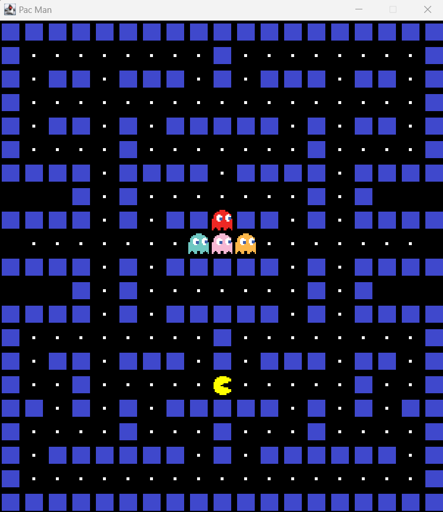

# Pacman in Java

Following this tutorial here: https://www.youtube.com/watch?v=lB_J-VNMVpE
//43:!3



Open in vscode and hit play button or cmd line cd into the src folder and run:

```
javac *.java
```

Then:

```
java App
```
